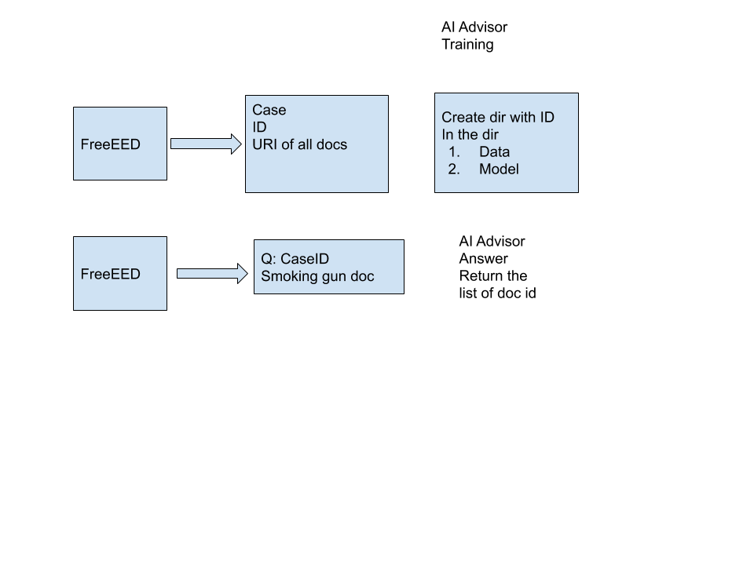

## Service


Currently the service writes data out to local pickle files.  This won't be very robust so we will likely switch to using sqllite.





## Packages

You must install `flask_restful` 

```bash
pip install flask_restful
```


## Running

To run the service, run the bash shell script:

```bash
cd service
bash ./run_service.sh

You will get a response something like this:

```console
 * Serving Flask app "api" (lazy loading)
 * Environment: production
   WARNING: Do not use the development server in a production environment.
   Use a production WSGI server instead.
 * Debug mode: on
 * Running on http://127.0.0.1:5000/ (Press CTRL+C to quit)
 * Restarting with stat
 * Debugger is active!
 * Debugger PIN: 814-782-702
```

## Testing 

In a separate window, type in the CURL:

```bash
curl http://localhost:5000
```

And you should get the response something like this:

```console
{ 'docsimilrity' : 'service'}
```


## Using Examples

```console


# Users

$ curl http://localhost:5000/users/user1 -d "user=myuser" -X put   # Add a New User
{
    "user": "myuser"
}

$ curl http://localhost:5000/users/user1 # retrive a user by user_id
{
    "user1": {
        "user": "myuser"
    }
}

$ curl http://localhost:5000/users # get all users 
{
    "user1": {
        "user": "myuser"
    }
}

# Projects


$ curl http://localhost:5000/projects/project1 -d "project=myproject" -d "user=user1" -X put   # Add a New Project
{
    "project": "myproject"
}

$ curl http://localhost:5000/projects/project1 # retrive a project by project_id 
{
    "project1": {
        "project": "myproject"
    }
}

$ curl http://localhost:5000/projects # get all projects
{
    "project1": {
        "project": "myproject"
    }
}

# Cases

curl http://localhost:5000/cases/case1 -d  "uri=myuri" -X put  
{
    "uri" : "myuri"
}

curl http://localhost:5000/cases -d "ng new" -X POST -v

curl http://localhost:5000/cases -d "case_id=case1" -d "task=something new" -X POST -v


curl \
--header "Content-type: application/json" \
--request PUT \
-d "uri="myuri" \
http://localhost:5000/cases/case1 

curl --request GET curl http://localhost:5000/cases/case1 

# URIs

$ curl http://localhost:5000/fileuris/fileuri1 -d "fileuri=uri-name1" -d "project=project1"  -X put   # Add a New File URI
{
    "": "myproject"
}


$ curl http://localhost:5000/fileuris/ # retrieve a URI by the uri-id
{
    "project1": {
        "project": "myproject"
    }
}

$ curl http://localhost:5000/fileuris # get all uris
{
    "project1": {
        "project": "myproject"
    }
}


```


